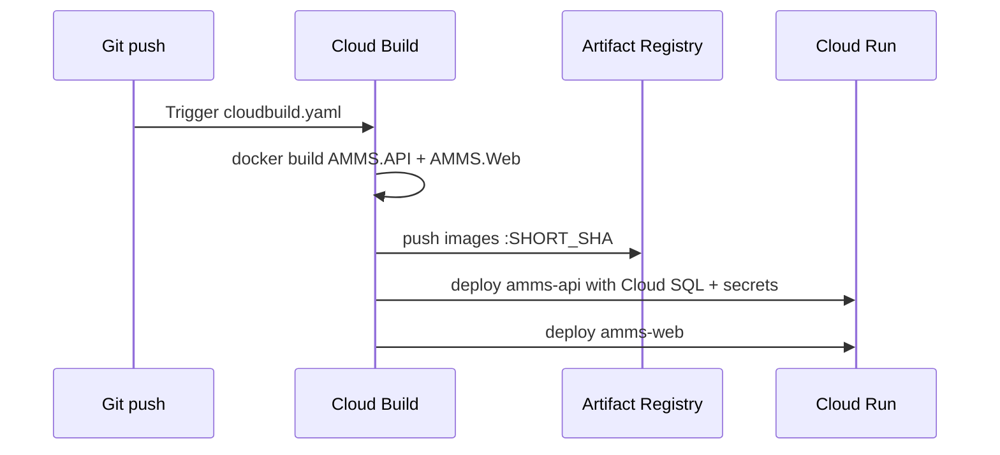

# Host AMMS on GCP (Cloud Run + Cloud SQL + Git repo connect)

This guide uses **Cloud Build connected to your Git repository** to build Docker images and deploy **two Cloud Run services** (`amms-api`, `amms-web`) on every push.

## Architecture

| Service | Image | Cloud SQL | Purpose |
|---------|-------|-----------|---------|
| `amms-api` | `AMMS.API/Dockerfile` | Yes | REST API + background worker |
| `amms-web` | `AMMS.Web/Dockerfile` | No | Razor Pages UI |

Cloud Build config: **`cloudbuild.yaml`** at the **repository root** (`SIIS_Association/cloudbuild.yaml`).  
Docker build context: **`AMMS/`** folder.

---

## Part 1 — One-time GCP setup (run once)

### 1. Prerequisites

- GCP project with billing enabled
- Owner or Editor on the project
- [gcloud CLI](https://cloud.google.com/sdk/docs/install) installed and logged in: `gcloud auth login`

### 2. Configure environment

```bash
cd AMMS
cp deploy/env.example deploy/.env
```

Edit `deploy/.env` and set at minimum:

| Variable | Example |
|----------|---------|
| `GCP_PROJECT_ID` | `my-project-123` |
| `GCP_REGION` | `asia-south1` |
| `CLOUDSQL_INSTANCE_NAME` | `amms-sql` |
| `SQL_USER` / `SQL_PASSWORD` | strong credentials |
| `SQL_DATABASE` | `AMMS` |
| `JWT_KEY` | 32+ character secret (or leave empty to auto-generate) |

### 3. Create infrastructure

```bash
chmod +x deploy/*.sh
./deploy/gcp-setup.sh
./deploy/setup-cloudbuild-iam.sh
```

This creates:

- Cloud SQL for SQL Server instance + `AMMS` database
- Artifact Registry repo `amms`
- Secret Manager: `amms-db-connection`, `amms-jwt-key`
- Runtime service account `amms-run@...` (Cloud SQL + secrets access)
- IAM for **Cloud Build** to push images and deploy Cloud Run

### 4. Publish database schema (one time)

Requires [SqlPackage](https://aka.ms/sqlpackage) and [Cloud SQL Auth Proxy](https://cloud.google.com/sql/docs/sqlserver/sql-proxy):

```bash
./deploy/publish-database.sh
```

---

## Part 2 — Connect your Git repository (Cloud Build)

### Option A — Google Cloud Console (recommended)

1. Open [Cloud Build → Repositories](https://console.cloud.google.com/cloud-build/repositories).
2. Click **Create host connection** (e.g. GitHub) and complete OAuth / app install.
3. Click **Connect repository** and select your repo (`SIIS_Association`).
4. Go to [Cloud Build → Triggers](https://console.cloud.google.com/cloud-build/triggers) → **Create trigger**.
5. Set:
   - **Name:** `amms-deploy-main`
   - **Event:** Push to a branch
   - **Branch:** `^main$` (or your default branch)
   - **Configuration:** Cloud Build configuration file (YAML or JSON)
   - **Location:** Repository
   - **Cloud Build config file:** `cloudbuild.yaml` (at repo root)
6. Under **Substitution variables**, override defaults if needed:

   | Variable | Value |
   |----------|--------|
   | `_REGION` | same as `GCP_REGION` in `.env` |
   | `_CLOUDSQL_INSTANCE` | e.g. `amms-sql` |
   | `_AR_REPO` | `amms` |
   | `_RUN_SA` | `amms-run` |
   | `_VPC_CONNECTOR` | leave empty unless using private IP + VPC connector |

7. Save. Push to `main` to run the first build.

### Option B — gcloud CLI

After connecting the repo in the console:

```bash
gcloud builds triggers create github \
  --name="amms-deploy-main" \
  --repo-name="SIIS_Association" \
  --repo-owner="YOUR_GITHUB_USER_OR_ORG" \
  --branch-pattern="^main$" \
  --build-config="cloudbuild.yaml" \
  --substitutions="_REGION=asia-south1,_CLOUDSQL_INSTANCE=amms-sql"
```

---

## Part 3 — What happens on each push



1. Build `amms-api` and `amms-web` Docker images from `AMMS/`.
2. Push to `{region}-docker.pkg.dev/{project}/amms/`.
3. Deploy `amms-api` with Cloud SQL connector and secrets from Secret Manager.
4. Deploy `amms-web`.

### Verify after a successful build

```bash
gcloud run services describe amms-api --region=asia-south1 --format='value(status.url)'
gcloud run services describe amms-web --region=asia-south1 --format='value(status.url)'
```

- API health: `https://<amms-api-url>/health`
- Web UI: `https://<amms-web-url>/Login`

---

## Part 4 — Docker layout (for Cloud Build)

```
SIIS_Association/          ← repo root (Cloud Build trigger points here)
├── cloudbuild.yaml        ← build + deploy pipeline
└── AMMS/                  ← Docker build context (dir: AMMS)
    ├── AMMS.API/Dockerfile
    ├── AMMS.Web/Dockerfile
    └── .dockerignore
```

**API container** listens on port **8080** (`ASPNETCORE_URLS=http://+:8080`). Cloud Run is configured with `--port=8080`.

**Secrets** are not in the image. Cloud Run injects:

- `ConnectionStrings__DefaultConnection` from Secret Manager
- `Jwt__Key` from Secret Manager

---

## Part 5 — Manual deploy (without Git trigger)

If you need a one-off deploy without pushing to Git:

```bash
cd AMMS
gcloud builds submit .. --config=../cloudbuild.yaml --project=YOUR_PROJECT_ID
```

(Submit from `AMMS` with config one level up, or from repo root:)

```bash
gcloud builds submit . --config=cloudbuild.yaml --project=YOUR_PROJECT_ID
```

---

## Troubleshooting

| Issue | Fix |
|-------|-----|
| Cloud Build permission denied on deploy | Run `./deploy/setup-cloudbuild-iam.sh` |
| API cannot connect to SQL | Check secret `amms-db-connection` uses `Server=127.0.0.1,1433;...` and `--add-cloudsql-instances` matches your instance |
| Build fails: project reference not found | Ensure trigger uses repo root config; build context must be `AMMS/` (see `dir: AMMS` in cloudbuild) |
| JWT errors at runtime | Ensure `amms-jwt-key` secret exists and `_RUN_SA` has `secretAccessor` |
| Background jobs stop | API uses `--min-instances=1`; increase if needed |

---

## Security checklist

- [ ] Rotate SQL password and JWT key that were ever committed to git
- [ ] Do not commit `deploy/.env`
- [ ] Restrict Cloud Run ingress if you need authentication at the edge
- [ ] Use private IP for Cloud SQL in production (`_VPC_CONNECTOR` substitution)

---

## Local Docker test (optional)

```bash
cd AMMS
docker build -f AMMS.API/Dockerfile -t amms-api:local .
docker run --rm -p 8080:8080 \
  -e ASPNETCORE_ENVIRONMENT=Development \
  -e ConnectionStrings__DefaultConnection="Server=..." \
  -e Jwt__Key="local-dev-only-change-me-32chars-minimum!!" \
  amms-api:local
curl http://localhost:8080/health
```
